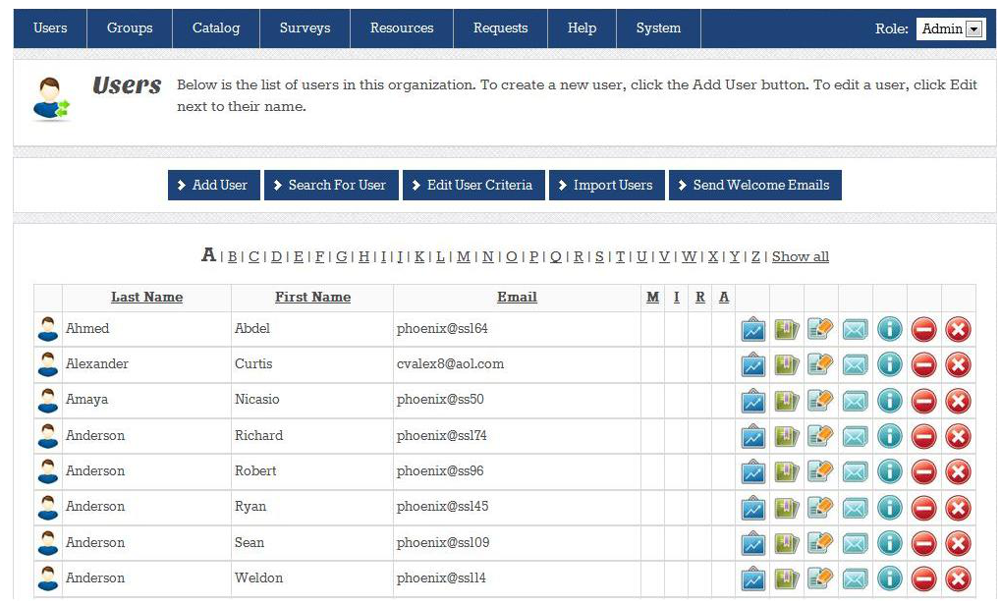

.. include:: global.rst

.. _users:

==========
Users
==========

The user section of allows administrators to:

- Add Users
- Search for Users
- Edit User Criteria
- Import Users
- Send Welcome Emails

Add Users
==========

Click the “Add User” button to add users. 

The “Edit User” screen displays. Enter the fields for the new user. 
The required fields are set by default. Other required fields, such as location shown in the following image, are set in the “Edit Criteria” section. 
